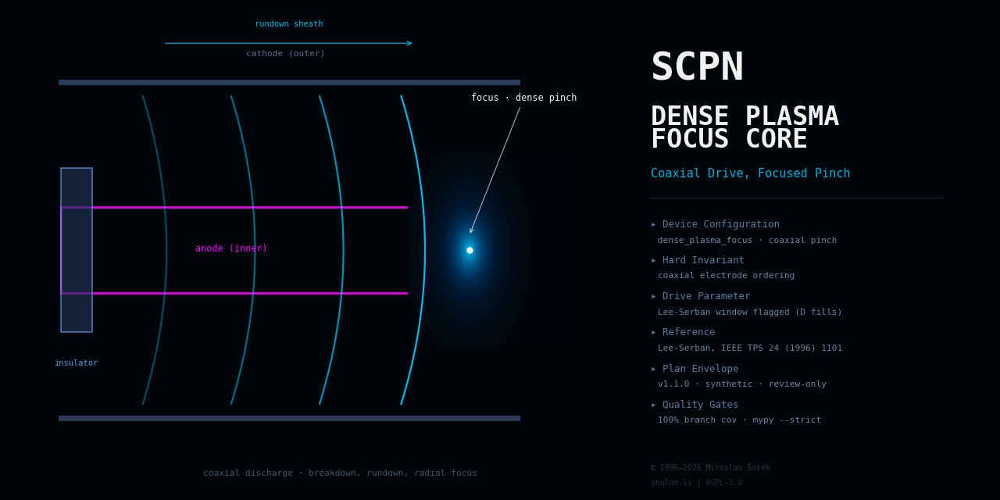

<!--
SPDX-License-Identifier: AGPL-3.0-or-later
Commercial license available
© Concepts 1996–2026 Miroslav Šotek. All rights reserved.
© Code 2020–2026 Miroslav Šotek. All rights reserved.
ORCID: 0009-0009-3560-0851
Contact: www.anulum.li | protoscience@anulum.li
SCPN Dense Plasma Focus Core — README
-->

<div align="center">
  
</div>

# SCPN Dense Plasma Focus Core

Governed device-family repository for dense-plasma-focus (DPF) fusion
systems within the SCPN Reactor Systems Research Group. This repository is
the designated owner of device-level truth for the `dense_plasma_focus`
configuration of the SCPN Phase Orchestrator reactor registry (coaxial
plasma-focus pinch).

**Evidence maturity: `computational_prototype`** (per-capability; ADR 0002).
Four capabilities are implemented: the device configuration model —
validated parameter objects with documented consistency estimates,
canonical serialisation, and a data-only SPO registry pin
(evidence: `VALIDATION.md#device-configuration-model`); the
diagnostic and clock semantics model — synthetic channel and clock
declarations aligned fail-closed with the pinned SPO observability
catalogue (ADR 0003, evidence:
`VALIDATION.md#diagnostic-and-clock-semantics`); and the level-0 device
physics — the closed forms of the Lee model (bank normalisation and
scaling parameters, axial and radial characteristic quantities, slug
relations, pinch-phase power terms, the fast-ion-beam chain, beam-target
and scaling-law neutron estimates) evaluated on the validated
configuration and a declared pinch state, anchored to the printed table
of twelve fitted machines, evaluated through the pinned shared numerics
kernels of `scpn-reactor-kernels`, with optional native kernels proven
bit-exact against the Python floor (ADR 0005 and ADR 0006, evidence:
`VALIDATION.md#level-0-device-physics`); and the device 3D model — a
validated mechanical envelope of the Mather-type layout and its analytic
bodies — the anode, the insulator sleeve, every rod of the squirrel-cage
cathode, the chamber and the declared pinch column — tessellated into closed
triangle meshes with binary STL and glTF 2.0 exports, built on the geometry
and placement kernels of the same pinned library (ADR 0007 and ADR 0008,
evidence: `VALIDATION.md#device-3d-model`, consumer contract:
`docs/DEVICE_3D_MODEL_CONTRACT.md`); and the device CAD model — the same
bodies, rod cage included, as B-rep solids on the pinned third-party
OpenCASCADE kernel through the shared library's CAD group, each checked
against its analytic closed form and against its tessellated twin, with a
normalised deterministic STEP export (ADR 0009, evidence:
`VALIDATION.md#device-cad-model`). No parameter set, channel or body
describes any real machine or diagnostic; the claim inventory is empty
and verified by the domain validator.

## Scope

This repository owns, for the dense-plasma-focus device family:

- the analytic device physics models: closed-form and 0-D models from the
  plasma-focus literature evaluated on the validated configuration (no
  solver code, no phase integration, no FUSION seam);
- the device boundary: plant and experiment truth, shot lifecycle, and
  configuration policy for coaxial-electrode devices whose discharge
  lifts a current sheath over an insulator, accelerates it down the
  coaxial gap, and rolls it into a dense micrometre-to-millimetre-scale
  pinch column at the anode tip, where instability-driven ion beams and
  hot spots produce the neutron yield;
- sheath-dynamics and focus-phase semantics (rundown, roll-over, radial
  collapse, pinch and disruption phases, beam-target contribution
  declarations) as device truth;
- diagnostic semantics, reference frames, and clock identity declarations;
- actuator-response model boundaries and the declared safety envelope;
- the device-owned CONTROL adapter specification;
- the binding to the SCPN Phase Orchestrator reactor registry
  (version `1.0.0`, digest
  `786d9542ce76c56dd7748fa948b17efed6c073525e527ce90e6d5e29a2d00090`);
- the machine-readable domain manifest `reactor-domain.json` and the derived
  Studio portfolio descriptor (integration state `not_federated`).

## Explicit exclusions

- **Generic axial-current Z-pinch devices**: `SCPN-Z-PINCH-CORE`. The DPF
  ends in a pinch, but its identity is the coaxial rundown and focus
  formation, not a preformed static column.
- **Beam-target fusion systems** (externally accelerated beams on
  targets): `SCPN-BEAM-TARGET-CORE`; the DPF's internal beam-target
  contribution is device truth here, not a beam-facility claim.
- **Theta pinch**: `SCPN-THETA-PINCH-CORE`.
- **Solver mathematics and validation evidence**: `SCPN-FUSION-CORE` until
  an exact surface passes the reactor family migration gate; no solver code
  exists in, or was copied into, this repository.
- **Typed signal semantics and comparability**: `SCPN-PHASE-ORCHESTRATOR`
  (review-only output; never actuation).
- **Control admission and action formation**: `SCPN-CONTROL` is the sole
  software authority that forms an admitted `ControlAction`.
- **Machine protection**: independent systems retain the final veto.
- **Portfolio presentation, identity, entitlement, and execution gating**:
  `SCPN-STUDIO`.

## Non-claims

This repository is not machine-ready, not safety-certified, and not
reactor-ready. It contains no implemented solver, no controller, no
experimental correlation, no dataset, and no published artefact; the
level-0 closed forms of the Lee model and their timing benchmark are
computational prototypes, not validated performance or yield claims, and
no parameter set describes or validates any real machine. Electrode-geometry, fill-gas, and repetition-rate
choices are configuration facets, not separate claims. No capability has reached any
evidence-maturity state beyond `computational_prototype`.

## Architecture

The five-surface boundary and the position of this repository in the SCPN
ecosystem are defined in [`docs/ARCHITECTURE.md`](docs/ARCHITECTURE.md) and
fixed by
[`docs/adr/0001-repository-boundary.md`](docs/adr/0001-repository-boundary.md).
The threat model is in [`docs/THREAT_MODEL.md`](docs/THREAT_MODEL.md); the
CONTROL adapter contract is in
[`docs/CONTROL_ADAPTER_SPECIFICATION.md`](docs/CONTROL_ADAPTER_SPECIFICATION.md).

## Validation

Every gate currently active in this repository is listed in
[`VALIDATION.md`](VALIDATION.md). The local sequence is:

```bash
make lint        # ruff check + ruff format --check
make typecheck   # mypy --strict src tools tests benchmarks
make test        # pytest with 100 % statement and branch coverage
make validate    # domain manifest, descriptor, and inventory checks
make rust        # native crate: fmt, clippy (warnings denied), tests
make preflight   # the full fail-closed gate sequence
```

## Security

See [`SECURITY.md`](SECURITY.md) for the supported states and the private
reporting route (protoscience@anulum.li).

## Licensing

AGPL-3.0-or-later for the public repository, with a commercial licence
available (see [`NOTICE.md`](NOTICE.md)). Licence texts are under
[`LICENSES/`](LICENSES/); machine-readable licensing metadata follows
REUSE 3.x (`REUSE.toml`).

## Citation

Citation metadata is provided in [`CITATION.cff`](CITATION.cff). No release,
version, or DOI exists yet; cite the repository state you inspected.
